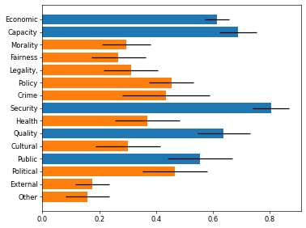
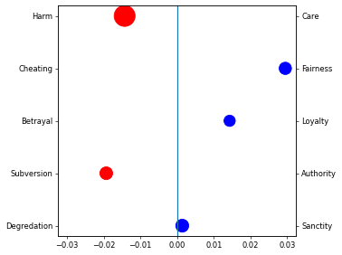
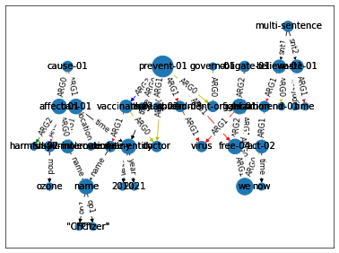

# Frame-Finder

Accepted for publication at CHIIR'24
Preprint available at: [Arxiv](https://arxiv.org/abs/2312.08995)

<!-- WARNING: THIS FILE WAS AUTOGENERATED! DO NOT EDIT! -->

## Install

``` sh
pip install framefinder
```

## How to use

``` python
import matplotlib.pyplot as plt
import pandas as pd
plt.rcParams['figure.dpi'] = 60
```

``` python
from framefinder import examples
```

``` python
from framefinder import framelabels

fl = framelabels.FramingLabels("facebook/bart-large-mnli", examples.candidate_labels)
res = pd.DataFrame(fl(examples.example_list))
fl.visualize(res.mean().to_dict(), xerr=res.sem())
plt.show()
```



``` python
from framefinder import framedimensions

fd = framedimensions.FramingDimensions("all-mpnet-base-v2", examples.dimensions, examples.pole_names)
fd.visualize(pd.DataFrame(fd(examples.example_list)))
plt.show()
```



``` python
from framefinder import framestructure

fs = framestructure.FramingStructure("Iseratho/model_parse_xfm_bart_base-v0_1_0")
fs.visualize(fs(examples.example_list))
plt.show()
```


